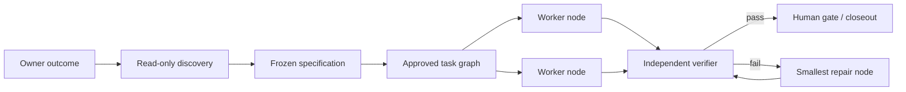

[English](README.md) | [中文](README.zh-CN.md)

# Agent TaskGraph Protocol

**Spec-first graph orchestration for AI coding agents.**

Current version: [`v0.8.0-beta.2`](VERSION) | License: [Apache-2.0](LICENSE)

> **Public Beta** for users who already work with Claude Code or Codex. Agent TaskGraph Protocol is currently a protocol-first AI coding orchestration skill, not an unattended queue service or a stable v1.0 runtime.

Agent TaskGraph Protocol is not about opening more agents. It is about making complex AI coding understandable, controlled, verifiable, and recoverable.

- Clear, low-risk work keeps the single-agent fast path.
- Complex, vague, or high-impact work starts with repository discovery and owner clarification, then freezes a specification and task graph.
- Workers execute in isolated worktrees; reviewers verify from independent context.
- Specifications, topology, state, and evidence live in project files instead of one chat's memory.

**One sentence can start intake. It does not automatically authorize complex implementation.**

## Who It Is For

| Good fit | Not yet a good fit |
|---|---|
| Claude Code or Codex users delegating complex work to multiple agents | Anyone expecting an unattended scheduler immediately after install |
| Multiple requirements, cross-module features, refactors, or release preparation | A one-off completion or tiny single-file edit |
| Teams that need explicit scope, parallel boundaries, evidence, and recovery | Work where every unanswered product question should be guessed silently |
| Owners who retain gates for migrations, deletion, permissions, merge, and release | Treating prompts, worktrees, or reviewers as a security sandbox |

## Contents

- [Quick Start](#quick-start)
- [Five Common Workflows](#five-common-workflows)
- [When the Owner Is Asked](#when-the-owner-is-asked)
- [How Tasks Are Triaged](#how-tasks-are-triaged)
- [Graph Engineering](#graph-engineering-for-ai-coding)
- [Checking Progress](#checking-progress)
- [Install, Update, and Uninstall](#install-update-and-uninstall)
- [Version and Update Notices](#version-and-update-notices)
- [Distribution Channels](#distribution-channels)
- [Public Beta Feedback](#public-beta-feedback)
- [Helper Commands](#helper-commands)
- [FAQ](#faq)
- [License](#license)
- [Beta Boundaries](#beta-boundaries)

## Quick Start

### 0. Prerequisites

- Git
- Bash
- Python 3
- A working Claude Code or Codex installation
- Optional network access for update checks

### 1. Clone and install

```bash
git clone https://github.com/wu736139669/agent-taskgraph-protocol.git
cd agent-taskgraph-protocol
./install.sh
./install.sh --status
```

The installer safely links the same checkout into:

- Claude Code: `~/.claude/skills/agent-taskgraph`
- Codex: `~/.codex/skills/agent-taskgraph`

Existing paths are refused by default. Do not begin with `--force`; inspect the conflict with `--status` first.

`--status` is local-only. Run `./install.sh --check-update` when you want to check the configured Git remote; the check never changes the working tree, pulls, or merges code.

### 2. Initialize the target project

From the Agent TaskGraph Protocol checkout:

```bash
./init.sh /path/to/your-project
```

Or from the target project through the installed Codex link:

```bash
cd /path/to/your-project
~/.codex/skills/agent-taskgraph/init.sh .
```

Use `.claude` instead of `.codex` for the Claude Code link.

Initialization creates:

```text
your-project/.agent-taskgraph/
├── PROJECT.md
├── STATUS.md
├── DECISIONS.md
├── templates/
├── queue/{inbox,active,review,done,failed}/
└── archive/
```

Running it again preserves existing files.

Existing Agent Queue beta projects are never moved implicitly. Review their state, then migrate explicitly:

```bash
./init.sh --migrate /path/to/your-project
```

### 3. Start a session in the target project

Open a new Claude Code or Codex session. Use `$agent-taskgraph` where a skill picker is available, or say:

```text
Use agent-taskgraph for this project.
First inspect the repository read-only and complete project onboarding.
Report confirmed facts, explicit inferences, and decisions only I can make.
Do not dispatch work until I approve PROJECT.md.
```

On first use, the agent inspects the stack, directories, build and test commands, shared files, and runtime capabilities. You then confirm permissions, session visibility, model preferences, and Human Gates in `.agent-taskgraph/PROJECT.md`.

## Five Common Workflows

### 1. Small task: use the fast path

```text
Use agent-taskgraph to fix the disabled state of the login button and add a regression test.
Acceptance: submission is blocked while required fields are empty, enabled when valid,
and the existing login flow must still pass.
```

Expected behavior: after a read-only check, a local, clear, low-risk, indivisible task exits PMO mode and stays with the current coding agent. Multi-agent overhead is not created for its own sake.

### 2. Complex feature: clarify before implementation

```text
Use agent-taskgraph to add team member management.
First inspect current users, roles, permissions, data models, and related UI.
Clarify invitations, removal, role changes, and permission boundaries with me.
Do not implement until I approve the frozen spec and task graph.
```

Expected behavior:

1. The agent reads the project before asking questions the code can answer.
2. It reports confirmed facts, explicit inferences, and owner decisions.
3. Each round asks only a few blocking questions with recommended defaults and tradeoffs.
4. Once open questions are resolved, it presents a `spec.md` summary for approval.
5. After the spec is frozen, it presents a `graph.yaml` summary for approval.
6. Only an approved graph can create implementation workers, worktrees, and reviewers.

A complete conversation looks roughly like this:

```text
Owner: Add team member management. Understand the project before coding.

PMO:
Confirmed: the project currently has owner/member roles; member data comes from ...;
the existing settings surface is ...
Inference: invitations may reuse the email service, but no product rule exists.
Decisions for you:
1. Who can invite? Recommendation: owner only, to prevent privilege spread.
2. Keep or transfer removed members' content? Recommendation: keep it and mark them as left.
3. Include invitation email copy? Recommendation: yes, without changing notifications.

Owner: Owner only; keep history; include email copy; do not change notifications.

PMO: Here is spec revision 1: <outcome / scope / non-goals / edges / acceptance>.
Open questions: none. Approve freeze?

Owner: Freeze spec revision 1. Show the graph, but do not execute.

PMO: Graph revision 1 has five nodes: data contract, backend and UI in parallel,
independent verification, then merge gate. The merge node owns shared writes;
failures return to the backend or UI repair node. Approve?

Owner: Approve graph revision 1 and execute. Merge still requires my approval.
```

The point is not to ask exactly three questions. The PMO first uses repository evidence to reduce uncertainty, then asks the owner only for product choices the code cannot answer.

### 3. Multiple requirements: model before parallelizing

```text
Use agent-taskgraph for these five requirements:
1. ...
2. ...
3. ...
4. ...
5. ...

Identify shared files, real dependencies, parallel nodes, and work that must remain serial.
Show me the spec and graph summary before dispatching anything.
```

The PMO must not reduce this to “one requirement, one agent.” An edge exists only when downstream work consumes upstream output, and parallel nodes require non-overlapping write scopes.

### 4. Resume after interruption

```text
Use agent-taskgraph to resume the current batch.
Read .agent-taskgraph/PROJECT.md, STATUS.md, the frozen spec and graph,
and active/review ledgers. Reconcile them with current sessions, branches,
and worktrees. Report differences before dispatching, and do not duplicate finished or running nodes.
```

The queue and ledgers are the dynamic source of truth. The frozen spec and graph are the static source of truth. Chat and thread status are observation signals only.

### 5. Change scope during execution

```text
This is a scope change: <new requirement>.
Pause affected nodes and show a spec/graph diff: retained, invalidated, and new nodes,
plus cost and risk changes. Do not add it to the running batch until I approve.
```

New ideas must not silently enter an active Goal.

## When the Owner Is Asked

The agent should discover project facts itself and ask only for choices it cannot infer safely.

| Stage | What the agent presents | What the owner does |
|---|---|---|
| First onboarding | Stack, acceptance commands, shared locks, runtime and permission policy | Confirm `PROJECT.md` |
| Complex clarification | Confirmed facts, inferences, and a few decisions with defaults | Decide behavior or scope |
| Spec freeze | One-page scope, non-goals, edge cases, acceptance, and open questions | Approve or request revision |
| Graph approval | Nodes, dependencies, parallel work, writes, failure routes, and gates | Approve before execution |
| Human Gate | Exact irreversible action, evidence, risk, and rollback | Allow or reject that action |
| Closeout | Changes, command evidence, reviewer result, and residual risk | Final review or a new batch |

Useful approval phrases:

```text
I approve the PROJECT.md policy.
Freeze spec revision 1; there are no open questions. Generate the graph, but do not execute yet.
I approve graph revision 1. Execute it; each Human Gate still requires separate approval.
I approve this Human Gate only: <exact action>.
Stop this batch. Dispatch no new nodes; preserve state and give me recovery instructions.
```

“Continue” or “use your judgment” is not unlimited authorization for migrations, deletion, elevation, merge, or release.

## How Tasks Are Triaged

| Type | Typical shape | Default path |
|---|---|---|
| A. Clear small task | Local, low-risk, reversible, clear acceptance | Current agent implements and self-tests |
| B. Decomposable goal | One outcome with independently verifiable parts | Freeze spec, build graph, execute in stages |
| C. Multiple requirements | Several jobs in one repository | Analyze conflicts and dependencies, then graph |
| D. Mixed batch | Features, fixes, research, and release work together | Classify, then combine into one batch graph |

High ambiguity, architecture sensitivity, permissions, privacy, payment, migration, deletion, or release impact always requires clarification and appropriate Human Gates.

## Graph Engineering for AI Coding



- **Task graph**: nodes are independently verifiable jobs; edges are real artifact dependencies.
- **Ownership graph**: one writer owns each artifact; parallel write scopes cannot overlap.
- **State graph**: `inbox -> active -> review -> done/failed`.
- **Evidence graph**: frozen input, artifacts, commands, reviewer, and handoff remain traceable.
- **Failure graph**: bounded repair returns to the earliest failed boundary.
- **Human-gate graph**: migrations, deletion, permissions, merge, release, and subjective decisions remain human-owned.

This is primarily a **delivery task graph**, not a code knowledge graph. A future code graph can improve repository discovery, but it cannot replace clarification, ownership, acceptance, or evidence.

## Roles

| Role | Does | Does not |
|---|---|---|
| PMO / Secretary | Onboarding, clarification, spec/graph, dispatch, monitoring, routing, closeout | Write implementation code after multi-agent mode starts |
| Expert, on demand | Produce product, technical, design, data, or domain contracts | Silently decide owner scope |
| Worker | Execute one Goal in an isolated worktree | Change the plan or queue state |
| Reviewer | Independently inspect the diff and rerun acceptance | Repair while reviewing |
| Owner | Freeze scope, take Human Gates, final review | Manually maintain routine queue state |

## Checking Progress

Ask the PMO:

```text
Report the current batch: node status, owner, latest evidence, blocker,
wait ownership, and the single next action. Use ledgers and current runtime state;
do not ping every worker just to answer.
```

Or inspect project files directly:

```bash
cat .agent-taskgraph/STATUS.md
find .agent-taskgraph/queue -mindepth 2 -maxdepth 2 -type d | sort
```

States:

- `inbox`: defined, not dispatched
- `active`: worker executing
- `review`: candidate under independent verification
- `done`: evidence gate passed
- `failed`: retries exhausted or owner decision required

An `idle` thread or a chat message saying “done” cannot by itself move work to `done`.

## Durable Project State

| File | Purpose | Primary maintainer |
|---|---|---|
| `.agent-taskgraph/PROJECT.md` | Facts, rules, shared files, permissions, runtime policy | PMO; owner confirms |
| `.agent-taskgraph/STATUS.md` | Lightweight active-task view | PMO derives it from queue/ledgers |
| `.agent-taskgraph/DECISIONS.md` | Append-only decision history | PMO |
| `spec.md` | Owner-approved outcome, scope, edges, and acceptance | PMO and owner |
| `graph.yaml` | Approved static nodes, dependencies, routes, and gates | PMO and owner |
| `goal.md` | Execution contract for one node | PMO creates; worker returns evidence |
| `ledger.md` | Dynamic status, owner, attempt, and evidence pointers | PMO alone transitions state |
| `report.md` | Accepted completion report | PMO |

Never store API keys, account credentials, private keys, or user data in these files. Whether `.agent-taskgraph/` is committed is a team decision; review machine-local log paths, session IDs, and privacy fields before committing.

## Install, Update, and Uninstall

### Status

```bash
./install.sh --status
```

### Version and Update Notices

The current protocol version is stored in [`VERSION`](VERSION). Check for a newer commit without changing the checkout:

```bash
./install.sh --check-update
```

The command fetches remote metadata only (Git may refresh `.git/FETCH_HEAD`). It reports one of these states:

- `current`: local checkout matches the configured branch
- `Update available`: fast-forwardable commits exist; review, then run `git pull --ff-only`
- `Update warning`: local and remote history diverged; reconcile manually
- `unavailable`: no network, Git checkout, or remote access; continue without blocking work

When the Skill is used, the PMO checks once at the start of the Owner's entry session with `--quiet`. An available update is shown to the Owner, never applied automatically. Worker and reviewer sessions do not repeat the check, and an active frozen batch stays on the protocol version recorded in its `PROJECT.md`. Set `AGENT_TASKGRAPH_SKIP_UPDATE_CHECK=1` for an offline environment.

### Update

```bash
cd /path/to/agent-taskgraph-protocol
git remote set-url origin https://github.com/wu736139669/agent-taskgraph-protocol.git
git pull --ff-only
./install.sh --status
./tests/smoke.sh
```

Normal updates require no reinstall because the skill directories are symlinks.

For the Agent Queue → Agent TaskGraph rename, run `./install.sh` once after updating. It creates the new `agent-taskgraph` links and removes old `agent-queue` links only when they point to this checkout. Migrate each project's state separately with `./init.sh --migrate <project>`.

### Resolve a name conflict

```bash
./install.sh --status
./install.sh --force
```

`--force` moves each conflict to a timestamped backup before linking. Backups are not automatically deleted or restored.

### Uninstall

```bash
./install.sh --uninstall
```

Uninstall removes only current or legacy skill links that point to this checkout. It does not remove the checkout or any project's `.agent-taskgraph/`.

## Distribution Channels

Keep GitHub as the canonical source and point every other listing to a tag or commit from this repository.

| Channel | Availability | Recommended use |
|---|---|---|
| GitHub repository | Public Beta | Canonical source, issues, reviews, and contributor history |
| [GitHub Releases](https://github.com/wu736139669/agent-taskgraph-protocol/releases) | `v0.8.0-beta.2` published | Versioned archives and release notes |
| Codex / Claude Code local install | Available now | `./install.sh` links this checkout into `~/.codex/skills/agent-taskgraph` and `~/.claude/skills/agent-taskgraph` |
| Team repository | Available now | Vendor or symlink the skill under `.agents/skills/` for a controlled team environment |
| [skills.sh](https://skills.sh) | CLI-compatible; directory listing is third-party | Install with `npx skills add wu736139669/agent-taskgraph-protocol --skill agent-taskgraph`; keep GitHub as the source of truth |
| OpenAI / Codex plugin directory | Package ready; platform submission pending | Test `plugins/agent-taskgraph` locally, then submit through the [OpenAI plugin portal](https://developers.openai.com/plugins/deploy/submission) |
| Claude Code plugin marketplace | Submitted; platform review pending | The package and catalog passed local validation; the public directory listing remains unavailable until platform approval |

The release order is: public GitHub repository, tagged GitHub release, `skills.sh` discovery, OpenAI/Codex package submission, then Claude Code marketplace submission. The current standalone folder remains the simplest installation path for beta users. Platform directories may approve or update packages on their own schedule; none is a second canonical repository.

The Git-based checker applies to standalone clones and symlink installs. Plugin marketplaces have their own package update lifecycle; keep the GitHub repository and release tag as the canonical version reference.

### Platform packages

The repository includes a self-contained package at [`plugins/agent-taskgraph`](plugins/agent-taskgraph) with both platform manifests:

- Codex: [`plugins/agent-taskgraph/.codex-plugin/plugin.json`](plugins/agent-taskgraph/.codex-plugin/plugin.json)
- Claude Code: [`plugins/agent-taskgraph/.claude-plugin/plugin.json`](plugins/agent-taskgraph/.claude-plugin/plugin.json)
- Claude marketplace catalog: [`.claude-plugin/marketplace.json`](.claude-plugin/marketplace.json)

The Claude Code package has been submitted for review but is not claimed to be publicly listed yet. The OpenAI/Codex package is prepared but has not completed platform submission. To test either package locally, run:

```bash
python3 "${CODEX_HOME:-$HOME/.codex}/skills/.system/plugin-creator/scripts/validate_plugin.py" \
  plugins/agent-taskgraph
claude plugin validate ./plugins/agent-taskgraph
```

For a standalone install, use `./install.sh`. For a directory-based install, use `npx skills add wu736139669/agent-taskgraph-protocol --skill agent-taskgraph`. Both paths resolve to the same Skill content and version.

## Public Beta Feedback

The repository's Issues are enabled for public feedback. Start with the pinned [Public Beta feedback thread](https://github.com/wu736139669/agent-taskgraph-protocol/issues/1), or choose the [Usage feedback](https://github.com/wu736139669/agent-taskgraph-protocol/issues/new?template=usage-feedback.md), [Bug report](https://github.com/wu736139669/agent-taskgraph-protocol/issues/new?template=bug-report.md), or [Feature/workflow proposal](https://github.com/wu736139669/agent-taskgraph-protocol/issues/new?template=feature-request.md) template.

Please remove secrets, tokens, credentials, private paths, session IDs, customer data, and other personal information before posting. Public Beta feedback is most useful when it includes the runtime, protocol version, task shape, workflow stages used, expected result, and observed result.

## Helper Commands

| Command | Purpose |
|---|---|
| `./init.sh <project>` | Initialize project state while preserving existing files |
| `./init.sh --migrate <project>` | Explicitly rename legacy `.agent-queue/` state and add missing current templates |
| `./workers/watch-worker.sh <log>` | Compact Codex JSONL or HAPI text logs into progress events |
| `./workers/log-cleanup.sh` | Dry-run archived Codex logs older than 30 days |
| `./workers/log-cleanup.sh --apply` | Delete the archived candidates just listed |
| `./workers/log-cleanup.sh --include-live` | Also preview live Codex/HAPI logs; still no deletion |
| `./tests/smoke.sh` | Validate install, init, parser, cleanup safety, and templates |

Live directories are scanned only with `--include-live`; deletion occurs only with `--apply`. Preserve logs referenced by Goals, ledgers, or reports.

## Runtime and Permission Model

- The skill probes the current environment; it does not assume every Codex exposes `create_thread`, `wait_threads`, or similar tools.
- Visible, owner-controllable sessions are preferred when available. Missing capabilities require an explicit fallback, not a fictional reviewer.
- Platform-standard permissions are the default. `yolo` or `--dangerously-skip-permissions` requires explicit authorization for the current project.
- Frozen scope, worktrees, and reviewers are quality controls, not security sandboxes.
- Dependency installs, migrations, deletion, privilege expansion, merge, and release should retain Human Gates defined in `PROJECT.md`.

## FAQ

### Does every request spawn multiple agents?

No. Small work stays with the current agent. Multi-agent mode is reserved for decomposable, parallel, or independently reviewed work.

### Is a one-sentence request enough?

It is enough to begin intake. The agent reads and triages first; complex work continues through clarification until the spec can be frozen.

### Is HAPI required?

No. HAPI is one visible-session option. Codex native threads, Claude CLI, or platform agent tools can serve as runtimes, but their real capabilities must be recorded in `PROJECT.md`.

### Why approve a graph after approving the spec?

The spec defines what to build and what counts as done. The graph defines who does each job, what it consumes and writes, how it is verified, and where failure returns.

### What if a session dies or work is interrupted?

Use the resume prompt above. The PMO reconciles file state, branches, worktrees, and sessions before deciding whether to resume, retry the smallest node, or wait for the owner.

### Can merge or release be automatic?

Only when `PROJECT.md` or the frozen batch explicitly authorizes it and the reviewer plus corresponding Human Gate have passed. The skill text itself is not authorization.

## License

Agent TaskGraph Protocol is released under the [Apache License 2.0](LICENSE). Copyright 2026 wu736139669. See the license text for the permissions, patent grant, notice requirements, warranty disclaimer, and liability limits.

## Beta Boundaries

Ready now:

- Project onboarding, requirement clarification, spec freeze, and graph approval
- Goal decomposition, queue/ledger protocol, and bounded failure routing
- Worker self-test, independent reviewer, and owner final review
- Conflict-safe install, project init, current Codex log parsing, and conservative cleanup
- Local smoke tests and GitHub Actions

Not yet implemented or guaranteed:

- No `dispatch.sh` or `run-worker.sh`; the active agent still invokes runtime tools
- No deterministic graph validator, ready-node calculator, or queue-transition CLI
- Cross-runtime quality still depends on actual tool capabilities and adherence to `SKILL.md`
- No stable-version guarantee; public release still needs a release policy, public-history review, and platform-specific packaging decisions

## Repository Layout

```text
agent-taskgraph-protocol/
├── SKILL.md
├── VERSION
├── LICENSE
├── agents/openai.yaml
├── install.sh
├── init.sh
├── scripts/
├── templates/
├── queue/
├── workers/
├── tests/
├── plugins/agent-taskgraph/  # platform package; root remains canonical
├── .claude-plugin/marketplace.json
└── .github/workflows/test.yml
```

The repository ships the operating protocol, deterministic helpers, templates, and an empty example queue. Real project state lives in that project's `.agent-taskgraph/`.

## Roadmap

- Deterministic graph validation and ready-node calculation
- Safe queue-transition CLI with consistency checks
- Runtime adapters for Codex, HAPI, and Claude
- Metrics for retry count, pass rate, latency, and token cost
- Sanitized case studies from a non-game project and a Codex-only environment
- Platform submission and review for the OpenAI/Codex and Claude Code packages
