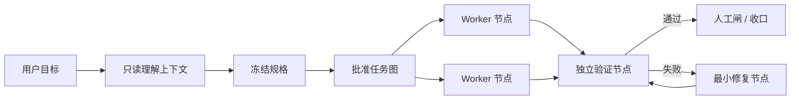

[English](README.md) | [中文](README.zh-CN.md)

# Agent TaskGraph Protocol

**面向 AI Coding 的规格优先 Agent 任务图编排协议。**

当前版本：[`v0.8.0-beta.2`](VERSION) | 许可证：[Apache-2.0](LICENSE)

> **Public Beta**：面向已经使用 Claude Code 或 Codex 的用户。它现在是一套 protocol-first 的 AI coding 编排 Skill，不是全自动任务队列服务，也不是稳定版 v1.0。

Agent TaskGraph Protocol 解决的不是“怎样同时开更多 Agent”，而是“怎样让复杂 AI coding 可理解、可控制、可验收、可恢复”。

- 清晰、低风险的小任务走单 Agent 快速路径。
- 复杂、模糊或高影响任务先读项目、与用户澄清、冻结规格，再建立任务图。
- Worker 在隔离工作区执行，Reviewer 用独立上下文验收。
- 规格、任务图、状态和证据落在项目文件中，不依赖某次聊天记忆。

**一句话可以开始接单，但复杂任务不会因为一句话就直接开工。**

## 适合谁

| 适合 | 暂不适合 |
|---|---|
| 已经熟悉 Claude Code / Codex，希望把复杂任务交给多 Agent | 希望安装后得到一个无人值守的全自动调度服务 |
| 同时处理多个需求、跨模块功能、重构、发布准备 | 只需要一次简单补全或单文件小修改 |
| 需要明确范围、并行边界、验收证据和失败恢复 | 不愿确认任何产品决策，却要求 Agent 自行猜测全部需求 |
| 愿意在迁移、删除、权限、合并和发布前保留人工闸 | 把 worktree、Reviewer 或提示词当成安全沙箱 |

## 目录

- [快速开始](#快速开始)
- [最常用的五种用法](#最常用的五种用法)
- [你会在什么时候被询问](#你会在什么时候被询问)
- [Agent 会怎样判断任务](#agent-会怎样判断任务)
- [Graph Engineering](#graph-engineering-在这里是什么意思)
- [怎样查看进度](#怎样查看进度)
- [安装、更新与卸载](#安装更新与卸载)
- [版本与更新提示](#版本与更新提示)
- [发布渠道](#发布渠道)
- [辅助命令](#辅助命令)
- [常见问题](#常见问题)
- [许可证](#许可证)
- [Beta 边界](#beta-边界)

## 快速开始

### 0. 准备环境

需要：

- Git
- Bash
- Python 3
- 已能正常使用的 Claude Code 或 Codex
- 用于可选更新检查的网络连接

### 1. 克隆并安装

```bash
git clone https://github.com/wu736139669/agent-taskgraph-protocol.git
cd agent-taskgraph-protocol
./install.sh
./install.sh --status
```

安装器会把同一份 Skill 安全链接到：

- Claude Code：`~/.claude/skills/agent-taskgraph`
- Codex：`~/.codex/skills/agent-taskgraph`

正常的状态输出会显示两个目标都指向当前仓库。安装器默认拒绝覆盖已有同名路径；不要一上来使用 `--force`，先运行 `--status` 看清冲突来源。

`--status` 只检查本地状态。需要检查远程是否有新版本时运行 `./install.sh --check-update`；它不会修改工作区、自动 pull 或合并代码。

### 2. 初始化目标项目

在 Agent TaskGraph Protocol 仓库中运行：

```bash
./init.sh /path/to/your-project
```

也可以在目标项目中通过已安装的 Skill 运行：

```bash
cd /path/to/your-project
~/.codex/skills/agent-taskgraph/init.sh .
```

使用 Claude Code 安装路径时，将上面的 `.codex` 换成 `.claude`。

初始化会创建：

```text
your-project/.agent-taskgraph/
├── PROJECT.md
├── STATUS.md
├── DECISIONS.md
├── templates/
├── queue/{inbox,active,review,done,failed}/
└── archive/
```

重复运行不会覆盖已有文件。

旧版 Agent Queue 项目不会被隐式移动。确认旧状态内容后，再显式迁移：

```bash
./init.sh --migrate /path/to/your-project
```

### 3. 在目标项目启动会话

进入目标项目，新开 Claude Code 或 Codex 会话。支持 Skill 选择器时可使用 `$agent-taskgraph`；也可以直接说：

```text
使用 agent-taskgraph 管理这个项目。
先只读分析项目并完成项目接入，告诉我已确认事实、合理推断和需要我决定的事项。
在我确认 PROJECT.md 前不要派发任务。
```

第一次接入时，Agent 会分析技术栈、目录、构建测试命令、共享文件和运行时能力，然后请你确认 `.agent-taskgraph/PROJECT.md` 中的权限、会话可见性、模型偏好和 Human Gates。

## 最常用的五种用法

### 1. 小任务：直接给结果

```text
使用 agent-taskgraph 修复登录按钮的禁用状态，并补一个回归测试。
验收标准是：未填写必填项时不可提交，填写后可提交，现有登录流程不能回归。
```

预期行为：只读确认相关代码和测试后，如果它确实局部、明确、低风险且不可有效拆分，就退出 PMO 编排，由当前 Agent 实现和自验，不为了“多 Agent”而制造开销。

### 2. 复杂功能：先聊清楚再做

```text
使用 agent-taskgraph 给这个产品增加团队成员管理。
先检查现有用户、角色、权限、数据模型和相关 UI，再跟我澄清邀请、移除、角色变更和权限边界。
在我确认冻结 spec 和任务图前不要写实现代码。
```

预期行为：

1. Agent 只读检查项目，不先问能从代码里查到的问题。
2. Agent 返回“已确认 / 合理推断 / 待用户决策”。
3. 每轮只问少量阻塞执行的问题，并给推荐默认值和影响。
4. 开放问题清零后，Agent 提交 `spec.md` 摘要让你冻结。
5. spec 冻结后，Agent 提交 `graph.yaml` 摘要让你批准。
6. 只有图获批后，才创建 Worker、worktree 和 Reviewer。

一次完整对话大致如下：

```text
Owner：增加团队成员管理。先理解项目，别急着写。

PMO：
已确认：当前只有 owner/member 两种角色；成员数据来自 ...；现有设置页在 ...
合理推断：邀请可能沿用现有邮件服务，但仓库里没有产品规则。
待你决定：
1. 谁可以邀请？推荐仅 owner，避免权限扩散。
2. 被移除成员的历史内容保留还是转移？推荐保留并显示“已离开”。
3. 本批次是否包含邀请邮件模板？推荐包含，但不改通知系统。

Owner：仅 owner；历史保留；包含邮件模板，不改通知系统。

PMO：这是 spec revision 1 摘要：<目标 / 范围 / 不做 / 边界 / 验收>。
开放问题：无。请确认是否冻结。

Owner：确认冻结 spec revision 1。先给任务图，不执行。

PMO：graph revision 1 有 5 个节点：数据合同 → 后端与 UI 并行 → 独立验证 → 合并闸。
共享写入由 merge 节点独占；失败分别回到后端或 UI 修复节点。请确认。

Owner：批准 graph revision 1，开始执行；合并仍需找我确认。
```

关键点不是固定问三道题，而是 PMO 先用代码证据缩小问题，再让 Owner 决定代码无法回答的产品选择。

### 3. 多个需求：先分析关系再并行

```text
使用 agent-taskgraph 处理下面 5 个需求：
1. ...
2. ...
3. ...
4. ...
5. ...

先识别共享文件、真实依赖、可并行节点和必须串行的部分。
先给我 spec 与任务图摘要，不要立即派发。
```

Agent 不应简单地“一需求一 Agent”。只有下游真实消费上游产物时才建立依赖；并行节点必须有不重叠的写入范围。

### 4. 中断后恢复：从文件状态继续

```text
使用 agent-taskgraph 恢复这个项目的当前批次。
先读取 .agent-taskgraph/PROJECT.md、STATUS.md、冻结 spec、graph 和 active/review ledger，
再对照当前会话、分支和 worktree 状态。先汇报差异，不要重复派发已经完成或仍在运行的节点。
```

恢复时以 `.agent-taskgraph/queue/` 和 ledger 为动态事实源，以冻结 spec/graph 为静态事实源。聊天记录和线程状态只能作为观察信号。

### 5. 执行中改需求：先看影响

```text
这是一个范围变更：<新要求>。
暂停受影响节点，给我 spec/graph diff：哪些节点保留、作废、新增，成本和风险怎么变化。
我确认前不要把新要求加入当前执行。
```

Agent 不应把新想法静默塞进正在运行的 Goal。

## 你会在什么时候被询问

Agent 应尽量自己从项目中查事实，只把无法安全推断的选择交给你。

| 阶段 | Agent 给你什么 | 你需要做什么 |
|---|---|---|
| 项目首次接入 | 技术栈、验收命令、共享锁、运行时和权限策略 | 确认 `PROJECT.md` |
| 复杂需求澄清 | 已确认、推断、少量产品决策及推荐值 | 回答真正影响范围或行为的问题 |
| 规格冻结 | 一页内 spec 摘要、开放问题和不做范围 | 明确批准或指出修改项 |
| 任务图审批 | 节点、依赖、并行点、写入范围、失败路由和人工闸 | 批准图后才开工 |
| Human Gate | 具体不可逆动作、证据、风险和回滚方式 | 决定是否允许执行 |
| 最终收口 | 完成内容、测试证据、Reviewer 结果、残余风险 | 终审或提出新批次 |

可以直接使用这些确认语句：

```text
确认 PROJECT.md 的项目策略。
确认冻结 spec revision 1；开放问题为无。继续生成任务图，但先不要执行。
批准 graph revision 1，按图执行。Human Gates 仍需逐项找我确认。
批准本次 Human Gate：<精确动作>。
停止当前批次，不再派发新节点；保存现状并给我恢复说明。
```

“继续做”“你看着办”不应被解释成对迁移、删除、提权、合并或发布的无限授权。

## Agent 会怎样判断任务

| 类型 | 典型情况 | 默认路径 |
|---|---|---|
| A. 清晰小任务 | 局部、低风险、容易回滚、验收明确 | 当前 Agent 快速实现和自验 |
| B. 可拆大目标 | 一个目标包含多个独立可验收部分 | 冻结 spec → 建图 → 分阶段执行 |
| C. 多个独立需求 | 多项工作共享同一项目 | 分析冲突与依赖 → 并行/串行图 |
| D. 混合任务 | 功能、修复、调研、发布准备混在一起 | 分类后合并成一张批次图 |

任一任务只要在需求、架构、权限、隐私、支付、迁移、删除或发布方面风险较高，就不能因为它看起来“只有一条需求”而跳过澄清与 Human Gate。

## Graph Engineering 在这里是什么意思



- **任务图**：节点是一份可独立验收的工作，边代表真实产物依赖。
- **所有权图**：一个产物只有一个 writer，并行节点不能写同一范围。
- **状态图**：`inbox -> active -> review -> done/failed`。
- **证据图**：冻结输入、产物、命令输出、Reviewer 和下游交接可追溯。
- **失败图**：失败回到最早失败边界对应的最小修复节点，重试有上限。
- **人工闸图**：迁移、删除、权限、合并、发布和主观决策明确由人负责。

这首先是一张**交付任务图**，不是代码知识图谱。未来可以接入代码图增强项目理解，但代码图不能代替需求澄清、范围所有权、验收标准和证据链。

## 角色与责任

| 角色 | 做什么 | 不做什么 |
|---|---|---|
| PMO / 秘书 | 接入、澄清、spec/graph、派发、监督、路由、收口 | 进入多 Agent 模式后不写实现代码 |
| 专家岗（按需） | 产出产品、技术、设计、数据或领域合同 | 不替 Owner 静默决定范围 |
| Worker | 在一个隔离 worktree 执行一个 Goal | 不改计划，不迁移队列状态 |
| Reviewer | 独立检查 diff 并重跑验收 | 不边审边修 |
| Owner | 冻结范围、处理 Human Gates、最终验收 | 不需要手工维护日常台账 |

## 怎样查看进度

直接问 PMO：

```text
给我当前批次状态：每个节点的状态、负责人、最后证据、卡点、等待归属和唯一下一步。
不要为了回答进度临时询问所有 Worker，先从 ledger 和当前会话状态汇总。
```

也可以直接查看项目文件：

```bash
cat .agent-taskgraph/STATUS.md
find .agent-taskgraph/queue -mindepth 2 -maxdepth 2 -type d | sort
```

状态含义：

- `inbox`：已定义，尚未派发
- `active`：Worker 正在执行
- `review`：候选结果正在独立验收
- `done`：证据门通过
- `failed`：重试耗尽或需要 Owner 决策

线程显示 `idle` 或聊天里说“完成了”，都不能单独把任务变成 `done`。

## 项目状态文件

| 文件 | 用途 | 主要维护者 |
|---|---|---|
| `.agent-taskgraph/PROJECT.md` | 项目事实、规范、共享文件、权限和运行时策略 | PMO，Owner 确认 |
| `.agent-taskgraph/STATUS.md` | 当前活跃任务的轻量视图 | PMO 从队列/ledger 派生 |
| `.agent-taskgraph/DECISIONS.md` | 关键决策的追加式历史 | PMO |
| `spec.md` | 用户已确认的目标、范围、边界和验收合同 | PMO 与 Owner |
| `graph.yaml` | 获批的静态节点、依赖、路由和 Human Gates | PMO 与 Owner |
| `goal.md` | 一个节点的执行合同 | PMO 创建，Worker 回填证据 |
| `ledger.md` | 动态状态、负责人、轮次和证据指针 | 仅 PMO 迁移状态 |
| `report.md` | Reviewer 通过后的完成汇报 | PMO |

不要把 API Key、账号凭据、私钥或用户数据写进这些文件。是否把 `.agent-taskgraph/` 提交到产品仓库由团队决定；提交前应检查本机日志路径、会话 ID 和其他隐私字段。

## 安装、更新与卸载

### 查看状态

```bash
./install.sh --status
```

### 版本与更新提示

当前协议版本记录在 [`VERSION`](VERSION)。检查配置的 Git 远程是否有新提交：

```bash
./install.sh --check-update
```

这个命令只抓取远程元数据（Git 可能刷新 `.git/FETCH_HEAD`），不会修改工作区或执行合并。状态含义：

- `current`：本地 checkout 与配置的分支一致
- `Update available`：存在可 fast-forward 的提交；确认后再运行 `git pull --ff-only`
- `Update warning`：本地与远程历史分叉，需要手工对账
- `unavailable`：无网络、不是 Git checkout 或没有远程权限；不阻塞当前工作

Skill 被使用时，PMO 只在 Owner 入口会话开始时用 `--quiet` 检查一次。有更新只提示 Owner，不自动更新；Worker 和 Reviewer 不重复检查。一个已经冻结的批次继续使用 `PROJECT.md` 记录的协议版本，更新放到新批次前由 Owner 决定。离线环境可设置 `AGENT_TASKGRAPH_SKIP_UPDATE_CHECK=1`。

### 更新

```bash
cd /path/to/agent-taskgraph-protocol
git remote set-url origin https://github.com/wu736139669/agent-taskgraph-protocol.git
git pull --ff-only
./install.sh --status
./tests/smoke.sh
```

安装使用软链，正常更新后不需要重复安装。

从 Agent Queue 升级到 Agent TaskGraph 时，更新仓库后运行一次 `./install.sh`。它会创建新的 `agent-taskgraph` 软链；只有旧 `agent-queue` 软链确实指向当前 checkout 时才删除。每个项目的状态目录需要另行运行 `./init.sh --migrate <project>`。

### 处理同名冲突

```bash
./install.sh --status
./install.sh --force
```

`--force` 会先把冲突路径移动到带时间戳的备份，再创建软链。备份不会被自动删除或恢复。

### 卸载

```bash
./install.sh --uninstall
```

卸载只删除指向当前 checkout 的现用 Skill 软链或旧版兼容软链，不删除 Agent TaskGraph Protocol 仓库，也不删除任何项目的 `.agent-taskgraph/`。

## 发布渠道

GitHub 仓库应始终是唯一主源，其他目录或安装包只指向本仓库的 tag 或 commit。

| 渠道 | 状态 | 推荐用途 |
|---|---|---|
| GitHub 仓库 | Public Beta | 唯一主源、源码、Issue、评审和贡献历史 |
| [GitHub Releases](https://github.com/wu736139669/agent-taskgraph-protocol/releases) | 已发布 `v0.8.0-beta.2` | 版本归档和发布说明 |
| Codex / Claude Code 本地安装 | 现在可用 | `./install.sh` 将 checkout 链接到 `~/.codex/skills/agent-taskgraph` 和 `~/.claude/skills/agent-taskgraph` |
| 团队内部仓库 | 现在可用 | 在受控团队环境中放入或链接到 `.agents/skills/` |
| [skills.sh](https://skills.sh) | CLI 已兼容；目录收录由第三方维护 | 使用 `npx skills add wu736139669/agent-taskgraph-protocol --skill agent-taskgraph` 安装；GitHub 仍是主源 |
| OpenAI / Codex Plugin 目录 | 包已准备，等待平台提交 | 本地验证 `plugins/agent-taskgraph` 后，通过 [OpenAI Plugin Portal](https://developers.openai.com/plugins/deploy/submission) 提交 |
| Claude Code Plugin Marketplace | 包和 catalog 已准备，等待平台提交 | 先运行 `claude plugin validate ./plugins/agent-taskgraph`，再通过 [Claude Plugin 提交页](https://platform.claude.com/plugins/submit) 提交 |

发布顺序是：公开 GitHub、发布带 tag 的 GitHub Release、提交 `skills.sh` 发现入口、提交 OpenAI/Codex 包、最后提交 Claude Code Marketplace。Beta 阶段继续使用当前独立 Skill 目录最简单。平台目录的审核和更新节奏各自独立；它们都不是第二个主仓库。

Git 更新检查只适用于独立 Git clone 和软链安装。Plugin Marketplace 使用各自的包更新机制；版本主线仍以 GitHub 仓库和 Release tag 为准。

### 平台包

仓库已包含自包含的平台包：[`plugins/agent-taskgraph`](plugins/agent-taskgraph)。根目录 Skill 仍是唯一 canonical source，平台包只是带清单的分发副本：

- Codex：[`plugins/agent-taskgraph/.codex-plugin/plugin.json`](plugins/agent-taskgraph/.codex-plugin/plugin.json)
- Claude Code：[`plugins/agent-taskgraph/.claude-plugin/plugin.json`](plugins/agent-taskgraph/.claude-plugin/plugin.json)
- Claude Marketplace catalog： [`.claude-plugin/marketplace.json`](.claude-plugin/marketplace.json)

当前包已经准备好本地验证，但不声称已经进入任何平台目录。发布前可运行：

```bash
python3 "${CODEX_HOME:-$HOME/.codex}/skills/.system/plugin-creator/scripts/validate_plugin.py" \
  plugins/agent-taskgraph
claude plugin validate ./plugins/agent-taskgraph
```

独立安装使用 `./install.sh`；目录安装使用 `npx skills add wu736139669/agent-taskgraph-protocol --skill agent-taskgraph`。两种方式都指向同一份 Skill 内容和版本。

## 辅助命令

| 命令 | 用途 |
|---|---|
| `./init.sh <project>` | 初始化项目实例，保留已有文件 |
| `./init.sh --migrate <project>` | 显式迁移旧 `.agent-queue/` 状态目录，并补齐缺失的新模板 |
| `./workers/watch-worker.sh <log>` | 把 Codex JSONL 或 HAPI 文本日志压缩成进展事件流 |
| `./workers/log-cleanup.sh` | dry-run 列出 30 天前的 Codex 已归档日志 |
| `./workers/log-cleanup.sh --apply` | 删除刚才列出的已归档候选 |
| `./workers/log-cleanup.sh --include-live` | 额外预览 live Codex/HAPI 日志，仍不删除 |
| `./tests/smoke.sh` | 验证安装、初始化、解析器、清理安全和模板 |

日志清理默认不碰 live 目录，只有显式 `--include-live` 才扫描；只有显式 `--apply` 才删除。被 Goal、ledger 或 report 引用的证据日志应保留。

## 运行时与权限

- Skill 会探测当前环境，不假设每个 Codex 都有 `create_thread`、`wait_threads` 等工具。
- 可用时优先用户可见、可接管的独立会话；不可用时必须报告实际 fallback，不能假装已经创建 Reviewer。
- 默认使用平台标准权限。`yolo` 或 `--dangerously-skip-permissions` 只有在当前项目被明确授权后才能使用。
- Frozen、worktree 和 Reviewer 是质量控制，不是安全沙箱。
- 依赖安装、数据库迁移、删除、权限扩大、合并和发布应按 `PROJECT.md` 保留 Human Gate。

## 常见问题

### 每个任务都会启动多个 Agent 吗？

不会。小任务留在当前 Agent；只有可拆、可并行或需要独立验收的复杂任务才进入多 Agent 模式。

### 一句话需求可以吗？

可以作为入口。Agent 会先读项目并分诊；复杂任务必须继续沟通，直到 spec 可冻结。

### 必须安装 HAPI 吗？

不必须。HAPI 是可见会话选项之一。Codex 原生线程、Claude CLI 或平台提供的 Agent 工具都可以作为运行时，但能力不同，必须在 `PROJECT.md` 记录真实可用路径。

### 为什么 spec 冻结后还要批准 graph？

spec 回答“做什么、做到什么算完成”；graph 回答“谁做、依赖什么、写哪里、怎样验证、失败回哪”。二者解决不同问题。

### Agent 卡住或会话断了怎么办？

使用“中断后恢复”提示词。PMO 应先对账文件状态、分支、worktree 和运行会话，再决定续接、最小重试或等待 Owner。

### 可以让 Agent 自动合并或发布吗？

只有 `PROJECT.md` 或当前冻结规格明确授权，且 Reviewer 和对应 Human Gate 已通过时才可以。Skill 文本本身不构成授权。

## 许可证

Agent TaskGraph Protocol 使用 [Apache License 2.0](LICENSE) 发布。Copyright 2026 wu736139669。具体授权、专利许可、NOTICE 要求、免责声明和责任限制以许可证全文为准。

## Beta 边界

已经具备：

- 项目接入、需求澄清、spec 冻结和 graph 审批
- Goal 拆分、队列/ledger 状态协议、有限失败路由
- Worker 自验、独立 Reviewer、Owner 终审
- 冲突安全安装、项目初始化、日志解析和保守清理
- 本地 smoke test 与 GitHub Actions

尚未实现或不承诺：

- 没有 `dispatch.sh` 和 `run-worker.sh`；派发仍由运行中的 Agent 调用平台工具
- 没有确定性的 graph validator、ready-node 计算器和状态迁移 CLI
- 跨运行时效果仍取决于实际工具能力和 Agent 是否正确遵循 `SKILL.md`
- 当前没有稳定版本保证；公开发布前仍需完成版本策略、公开历史审查和平台 Plugin 包决策

## 仓库结构

```text
agent-taskgraph-protocol/
├── SKILL.md
├── VERSION
├── LICENSE
├── agents/openai.yaml
├── install.sh
├── init.sh
├── scripts/
├── templates/
├── queue/
├── workers/
├── tests/
├── plugins/agent-taskgraph/  # 平台包；根目录仍是唯一主源
├── .claude-plugin/marketplace.json
└── .github/workflows/test.yml
```

仓库分发的是运营协议、确定性辅助脚本、模板和空示例队列。每个产品项目的真实状态保存在该项目自己的 `.agent-taskgraph/` 中。

## Roadmap

- 确定性 graph 校验与 ready-node 计算
- 带一致性检查的安全队列迁移 CLI
- Codex、HAPI、Claude runtime adapters
- 重试、通过率、耗时和 token 成本指标
- 一个非游戏项目和一个纯 Codex 环境的脱敏案例
- OpenAI/Codex 与 Claude Code 平台包的提交与审核
