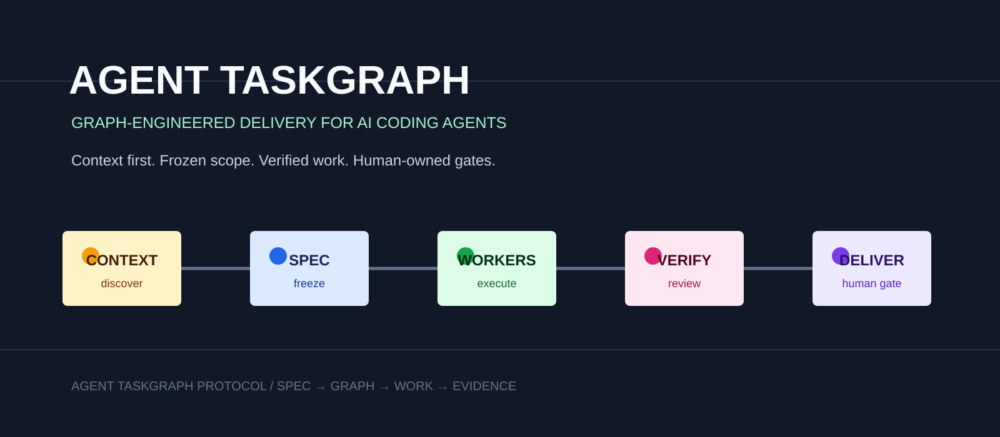

[English](README.md) | [中文](README.zh-CN.md)

# Agent TaskGraph

**面向 Codex 和 Claude Code 的原生多 Agent 编排 Skill。**

版本：[`v0.8.0-beta.17`](VERSION) | 许可证：[Apache-2.0](LICENSE)

Agent TaskGraph 帮当前会话判断任务是否值得并行，然后使用宿主自带的 Agent 能力拆分、派发、监督和验收。它不启动另一套调度服务，也不要求每个任务都创建项目状态目录。

## 核心变化

- **单 Agent 优先**：小任务留在当前会话，避免协调开销。
- **纯原生运行**：Codex 使用原生 subagents；Claude Code 默认使用 subagents，需要 teammates 互相协作时才使用 Agent Teams。
- **主会话不空转**：协调者可以同时完成一个不与 Worker 重叠的任务；只有明确要求 lead-only 时才保持纯 PMO。
- **最小上下文**：Worker 获得自包含任务，不复制主会话全部历史。
- **写入隔离**：并行写任务必须使用 worktree 或不重叠路径。
- **按需持久化**：`.agent-taskgraph/` 只用于跨会话、可恢复或需要审计的工作。
- **原生监督**：使用宿主的 spawn、message、wait、resume 和 stop，不维护第二套 session 状态机。

## 安装

```bash
git clone https://github.com/wu736139669/agent-taskgraph-protocol.git
cd agent-taskgraph-protocol
./install.sh
./install.sh --status
```

安装器会把同一个 Skill 链接到：

- `~/.codex/skills/agent-taskgraph`
- `~/.claude/skills/agent-taskgraph`

已有的非本仓库路径不会被覆盖；需要备份后替换时使用 `./install.sh --force`。

## 使用

在 Codex 或 Claude Code 中直接说：

```text
使用 agent-taskgraph 完成这个任务。值得并行就用当前宿主的原生 Agent，不值得就当前会话直接做；并行写入必须隔离，最后统一检查 diff 和测试。
```

用户明确要求先看计划时：

```text
使用 agent-taskgraph。先给我简短的执行模式、分工、写入边界和验收，等我确认再开始。
```

Skill 会先读项目，再选择：

| 情况 | 执行方式 |
|---|---|
| 小修复、单模块、顺序工作 | 当前会话直接完成 |
| 两个以上独立的探索或实现任务 | 原生 subagents |
| Claude teammates 必须互相讨论或认领共享任务 | Claude Agent Teams |
| 没有原生 Agent 能力或无法隔离写入 | 降级为当前会话 |

## Codex

Codex 中使用当前客户端暴露的原生 subagent / agent-thread 工具。每个 Agent 接收一个自包含任务；若 spawn 接口支持上下文继承选项，Skill 会选择空白或最小上下文，而不是复制完整主会话历史。

独立 Agent thread 不必然代表独立 worktree。并行写入前必须观察到真实隔离，或把文件范围明确分开。主会话使用原生 Agent 列表、消息和等待能力监督，结果不完整时优先在原 thread 上继续。

## Claude Code

聚焦的实现、探索、测试和审查默认使用 subagents。自定义 subagent 可以在 `.claude/agents/` 中定义工具、权限、skills 和 worktree isolation。

只有 teammates 必须互相通信、共享任务列表或协作决策时才使用 Agent Teams。若 Agent Teams 未启用或不适合当前写入范围，Skill 使用 subagents 或当前会话，不会伪装成多会话团队。

## 一个任务合同包含什么

每个 Worker 只获得开始工作所需的事实：

1. 一个可验收目标
2. 3-6 个必须读取的路径、符号或直接 handoff
3. 允许写入和明确不负责的范围
4. 真实依赖
5. 验证命令或可观察结果
6. 完成时的摘要、修改路径、验证和风险

Worker 默认不提交、合并、打 Tag、推送或发布。最终 Git 操作和外部副作用仍由主会话按照用户授权执行。

## 可选持久化状态

普通单次会话不需要初始化。工作需要跨会话恢复、保存复杂依赖或审计记录时，再运行：

```bash
./init.sh /path/to/project
```

生成：

```text
.agent-taskgraph/
├── PROJECT.md
├── PLAN.md
├── TEAM.md
├── STATUS.md
├── DECISIONS.md
├── tasks/TEMPLATE.md
└── archive/
```

旧 `.agent-queue` 目录可以显式迁移：

```bash
./init.sh --migrate /path/to/project
```

迁移只重命名并补齐当前最小模板，不会重写已有内容。

持久化目录恢复的是任务事实和 handoff，不是正在运行的 Agent。Codex subagent thread 和 Claude teammates 都不能被假定在客户端重启或主会话恢复后仍然存在；新会话应先检查真实状态，再根据 handoff 恢复或重新创建任务。

## 权限与成本

Skill 默认继承当前宿主的模型、推理和权限，不硬编码模型名，也不启用 bypass、无 sandbox 或 `--yolo`。若 Agent 会继承异常宽泛的父会话权限，会在第一次创建前说明。多 Agent 不扩大安装、联网写操作、迁移、删除、合并、Tag、推送或发布的授权范围。

Agent Teams 和大量并行 Agent 会增加 token 成本。Skill 默认只创建 2-3 个确有独立工作的 Agent，不为固定组织结构创建空闲角色。

## 验证与更新

```bash
./tests/smoke.sh
./install.sh --check-update
```

更新检查只读取远端状态，不会自动修改当前安装。完整协议见 [`SKILL.md`](SKILL.md)，运行时选择细节见 [`references/native-runtimes.md`](references/native-runtimes.md)。
