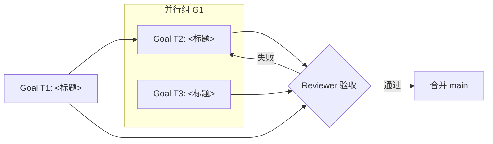

# 任务图（GRAPH）

> 当前活跃任务的拓扑视图。PMO 维护：**每次派发 / 状态变化时更新**。
> 节点 = 活跃任务（goal），边 = 依赖 / 交接（来自各 goal 的"依赖与边"字段）。
> 归档任务不画（历史不加载）。老板看这张图 = 一眼知道团队在怎么协作。

## 当前拓扑说明

- 并行：<G1 等任务同时开工>
- 串行/依赖：<T1 完成后 T2 才开工>
- 风险点：<哪条边可能冲突/失败/需要老板决策>
